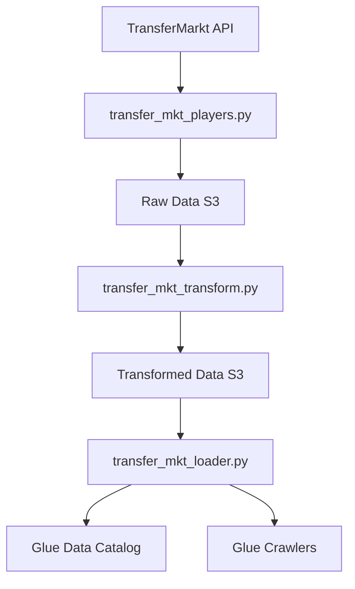

# TransferMkt Data Engineering Pipeline

A modular, production-ready data engineering pipeline for extracting, transforming, and loading TransferMarkt football data into AWS infrastructure.

## 🏗️ Architecture Overview

This project has been refactored to follow data engineering best practices with a clear separation of concerns and modular design. The architecture consists of:

- **Thin wrapper scripts** for Airflow DAG compatibility
- **Modular package structure** for reusable components  
- **Centralized configuration** and logging
- **Clean separation** of extraction, transformation, and loading logic

## 📁 Project Structure

```
TransferMktApp/
├── transfermkt/                    # Main package with modular components
│   ├── __init__.py                # Package initialization
│   ├── config.py                  # Centralized configuration
│   ├── logger.py                  # Logging utilities
│   ├── io_utils.py                # I/O operations (S3, API, Glue)
│   ├── transform_utils.py         # Data transformation functions
│   └── player_logic.py            # Player-specific business logic
├── transfer_mkt_loader.py         # Schema management entry point
├── transfer_mkt_players.py        # Player data extraction entry point  
├── transfer_mkt_transform.py      # Data transformation entry point
├── requirements.txt               # Python dependencies
├── Dockerfile                     # Container configuration
└── README.md                      # This file
```

## 🔧 Key Components

### 1. Configuration Management (`transfermkt/config.py`)
- Centralized configuration for AWS credentials, S3 paths, API endpoints
- Environment-based configuration loading
- Validation utilities for required settings

### 2. I/O Operations (`transfermkt/io_utils.py`)
- **S3Client**: Handles all S3 operations (upload, download, cleanup)
- **GlueClient**: Manages AWS Glue schema operations and crawlers
- **APIClient**: Handles TransferMarkt API interactions and web scraping

### 3. Data Transformation (`transfermkt/transform_utils.py`)
- Modular transformation functions for each data type
- Type inference for Glue schema management
- Market value parsing and data cleaning utilities

### 4. Player Logic (`transfermkt/player_logic.py`)
- **PlayerDataManager**: Orchestrates player data extraction
- Concurrent data fetching for improved performance
- Business logic for player-related operations

### 5. Logging (`transfermkt/logger.py`)
- Centralized logging configuration
- Execution time tracking decorators
- Consistent log formatting across modules

## 🚀 Entry Point Scripts

The three main scripts serve as thin wrappers that maintain Airflow DAG compatibility while leveraging the modular architecture:

### `transfer_mkt_players.py`
- Extracts all player-related data from TransferMarkt API
- Orchestrates concurrent data fetching
- Uploads raw data to S3

### `transfer_mkt_transform.py` 
- Transforms raw JSON data into structured formats
- Applies business rules and data cleaning
- Outputs pipe-delimited CSV files to S3

### `transfer_mkt_loader.py`
- Updates Glue table schemas based on transformed data
- Starts AWS Glue crawlers for data catalog refresh
- Manages schema evolution

## 📊 Data Flow



## 🛠️ Installation & Setup

### Prerequisites
- Python 3.8+
- AWS account with appropriate permissions
- Environment variables for AWS credentials

### Installation
```bash
# Clone the repository
git clone <repository-url>
cd TransferMktApp

# Install dependencies
pip install -r requirements.txt

# Set environment variables
export AWS_ACCESS_KEY_ID=your_access_key
export AWS_SECRET_ACCESS_KEY=your_secret_key
```

### Environment Variables
```bash
AWS_ACCESS_KEY_ID=your_aws_access_key_id
AWS_SECRET_ACCESS_KEY=your_aws_secret_access_key
```

## 🔄 Usage

### Running Individual Scripts
```bash
# Extract player data
python transfer_mkt_players.py

# Transform data
python transfer_mkt_transform.py

# Load and manage schemas
python transfer_mkt_loader.py
```

### Using as a Package
```python
from transfermkt.player_logic import PlayerDataManager
from transfermkt.config import Config
from transfermkt.logger import setup_logging

# Set up logging
setup_logging()

# Extract player data
manager = PlayerDataManager()
data = manager.extract_all_player_data()
```

## 📈 Data Processing

### Supported Data Types
- **Club Profiles**: Basic club information and metadata
- **Player Profiles**: Detailed player information, positions, contracts
- **Player Statistics**: Performance metrics, appearances, goals
- **Market Values**: Historical and current market valuations
- **Injuries**: Injury history and impact analysis
- **Transfers**: Transfer history and transaction details
- **Achievements**: Player awards and accomplishments
- **League Tables**: League standings and statistics

### Data Transformations
- Market value parsing (€10.5m → 10500000.0)
- Date standardization and validation
- Type inference for schema management
- Array expansion for multi-value fields
- Data cleaning and validation

## 🔧 Configuration

### AWS Resources
- **S3 Bucket**: `transfermkt-data`
- **Glue Database**: `transfermarket_analytics`
- **Region**: `us-east-1`

### Customization
Modify `transfermkt/config.py` to adjust:
- Competition codes and league names
- S3 bucket names and paths
- Glue database and crawler names
- Processing parameters

## 🧪 Testing

The modular structure enables easy unit testing:

```python
# Example test structure
from transfermkt.transform_utils import parse_market_value

def test_market_value_parsing():
    assert parse_market_value("€10.5m") == 10500000.0
    assert parse_market_value("€500k") == 500000.0
```

## 🔍 Monitoring & Logging

- Comprehensive logging with execution time tracking
- Error handling with detailed stack traces
- Performance metrics for optimization
- Data quality validation

## 🚀 Performance Features

- **Concurrent Processing**: Parallel API calls for player data
- **Efficient S3 Operations**: Bulk uploads and optimized transfers
- **Smart Caching**: Avoid redundant API calls
- **Memory Management**: Streaming data processing

## 🛡️ Error Handling

- Graceful degradation for missing data
- Retry mechanisms for transient failures
- Comprehensive validation at each stage
- Detailed error reporting

## 📝 Maintenance

### Adding New Data Types
1. Add API endpoint to `player_logic.py`
2. Create transformation function in `transform_utils.py`
3. Update S3 paths in `config.py`
4. Add to orchestration scripts

### Schema Evolution
The pipeline automatically handles schema changes by:
- Detecting column differences
- Updating Glue table schemas
- Preserving data compatibility

## 🤝 Contributing

1. Follow the modular structure when adding features
2. Add comprehensive logging and error handling
3. Include type hints and docstrings
4. Test individual components before integration

## 📄 License

This project is licensed under the MIT License.

## 🔗 Dependencies

See `requirements.txt` for the complete list of dependencies including:
- pandas: Data manipulation and analysis
- boto3: AWS SDK for Python
- requests: HTTP library for API calls
- numpy: Numerical computing support
